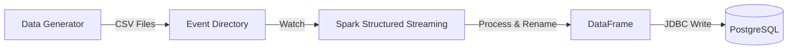

# Real-Time E-commerce Data Pipeline 🚀

A robust, real-time data ingestion pipeline that simulates e-commerce user events, processes them using **Apache Spark Structured Streaming**, and persists the data into a **PostgreSQL** database for analysis.


## 🏗️ Architecture



## ✨ Features
- **Synthetic Data Generation**: Python script (`data_generator.py`) creates realistic e-commerce events (views, cart adds, purchases) with absolute path resolution.
- **Real-Time Processing**: Spark job (`spark_streaming_to_postgres.py`) continuously monitors for new data.
- **Automatic Schema Mapping**: Automatically handles schema differences (renames `item_id` → `product_id`).
- **Secure Configuration**: Uses `.env` for database credentials.
- **Robust Logging**: Logs both to console and file (`logs/pipeline.log`).

## 🛠️ Technologies
- **Language**: Python
- **Engine**: Apache Spark (PySpark)
- **Database**: PostgreSQL
- **Libraries**: `pandas`, `faker`, `python-dotenv`, `psycopg2-binary`

## 🚀 Getting Started

### Prerequisites
- Python 3.8+
- PostgreSQL installed and running locally
- Java 8 or 11 (required for Spark)

### Installation
1.  **Clone the repository**:
    ```bash
    git clone https://github.com/Xenongt1/Real_time_ecommerce_pipeline.git
    cd Real_time_ecommerce_pipeline
    ```

2.  **Install Dependencies**:
    ```bash
    pip install pandas pyspark python-dotenv psycopg2-binary
    ```

3.  **Configure Environment**:
    Create a `.env` file in the root directory:
    ```env
    YOUR_POSTGRES_PASSWORD=your_actual_password
    ```

4.  **Setup Database**:
    Run `sql/postgres_setup.sql` in your Postgres instance to create the `ecommerce_db` and `user_events` table.

### Usage
Run the components in **two separate terminals**:

**Terminal 1: Generate Data**
```bash
python scripts/data_generator.py
```

**Terminal 2: Start Pipeline**
```bash
python scripts/spark_streaming_to_postgres.py
```

Watch the logs to see batches being processed and written to the database!

## 📂 Project Structure
```
├── data/               # Generated event data
├── docs/               # Detailed documentation
├── logs/               # Application logs
├── scripts/
│   ├── data_generator.py             # Event simulation script
│   └── spark_streaming_to_postgres.py # ETL Pipeline
├── sql/
│   └── postgres_setup.sql            # Database schema
└── .env                # Secrets (GitIgnored)
```
